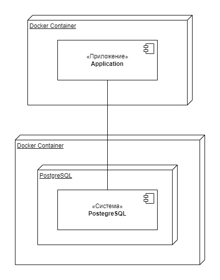

# Getting Started

### Решенные задачи
Данное приложение является одним решением для двух задач — поиска наиболее часто встречающихся 
слов в текстовых файлах, и эффективного удаления данных из таблиц.

Решения представлены в виде двух RESTful контроллеров для управления задачей и получения результатов.  

Для частоты слов используется параметризируемый **GET** запрос вида: `localhost/api/v1/words/frequency?folderPath=testpath&minLength=10&topCount=10`

Для отчистки таблиц используется **DELETE** метод с запросом: `localhost/api/v1/tables/{tableName}?olderThan=, где tableName — переменная пути запроса`

### Технологии

* Java — 17
* Spring — 3.3.2
* Flyway, Guava

### Запуск и развертка
Приложение запускается и разворачиваетя в виде docker-контейнера.

Для автоматизации развертки написан скрипт `run.sh `

Полный процесс запуска описан в файле `READ.md`

#### Диаграмма развертывания

### Тестирование 
Для использования тестовых данных, разархивируйте файл testfolder/data.zip 
Для тестирования решений определены следующие тестовые данные: 
* Для частотности слов — директория testfolder в корне проекта
* Для очистки таблиц — написан скрипт автоматической генерации миллионов случайных данных в десяти таблицах 
`src/main/resources/db/migration/V1__init_tables.sql`

Так же для удобства тестирования в директории **docker/test** расположена Postman-коллекция с описанием API